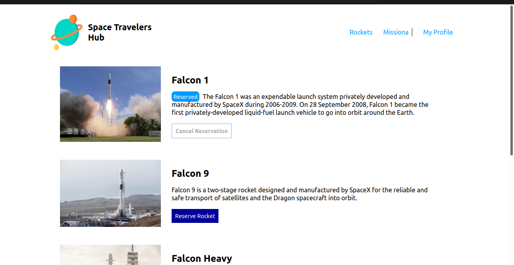
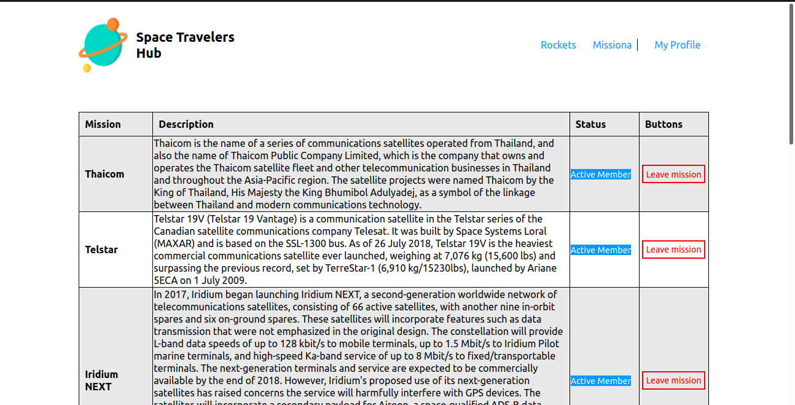
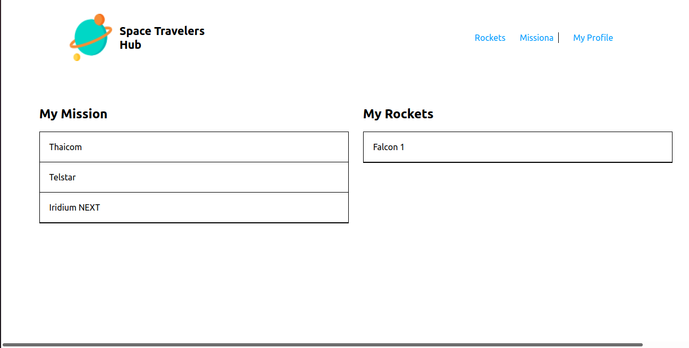

# Space Travellers

Space travellers is a project that lists information from the space-x Api about the space [rockets](https://api.spacexdata.com/v3/rockets) that they have and the [missions](https://api.spacexdata.com/v3/missions) that they have already done.

The project is interesting as it allows users to book rockets as well as join a mission that they feel they are interested in. All booked rockets and joined missions can be viewed from the myProfile page.

Enjoy!

## Built With

- HTML5
- CSS
- Javascript
- React
- Redux
- API
- Webpack
- Linters

## Live Demo

This project was deployed to two places:
- [Netlify]() none at the moment
- [Heroku]() none at the moment

## Getting Started
To get a local copy up and running follow these simple example steps.

In your terminal, navigate to your current directory and run this code

`git@github.com:Nemwel-Boniface/spacetravellers.git`

Locate the directory in your file explorer

`cd spacetravellers`

Install npm or if installed already using this link

Start the web dev server depending on your configuration

The Project should now be live on your browser

## Tests
To run your tests you can run:
- `npm test` for unit tests with the React testing library & Jest
- `npx eslint .` for all your JavaScript based linter checks
- `npx stylelint "**/*.{css,scss}"` for all your CSS based linter checks

## Authors

👤 **Author1**
To run your tests you can run:
- Twitter: [@nemwel_bonie](https://twitter.com/nemwel_bonie)
- LinkedIn: [LinkedIn](https://www.linkedin.com/in/nemwel-nyandoro-aa1b2620b/)

👤 **Author2**

- GitHub: [@AckonSamuel](https://github.com/AckonSamuel)
- Twitter: [@AckonSamuel](https://twitter.com/AckonSamuel2)

Contributions, issues, and feature requests are welcome!

Feel free to check the [issues page](https://github.com/Nemwel-Boniface/spacetravellers/issues).

## Show your support